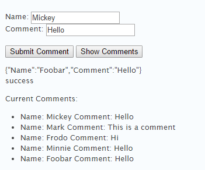

# Lab5-MongoComments
CS260 Mongo Lab

Many social media applications allow users to insert comments. In this lab, you will configure a MongoDB database and connect it to your node.js web server. 

Create a jquery application to display entries from the database and allow users to enter new comments. Your output should look something like this:

------

----

When you click the "submit button", fill in a div with the JSON string you will send to the POST interface of your REST service. When the REST service returns, fill in the next div with "success". When the user clicks "show comments", contact the GET interface of your REST service and retrieve all of the comments currently in the database and print them in an unordered list.

These [hints](http://bioresearch.byu.edu/cs260/mongohints.html) may be helpful as your implement your node/mongodb application.

Passoff:

You should test your server to make sure it works with your jquery script.  Your submission to learningsuite should contain:

	- The URL of the working application on your EC2 node (or other host). 

<strong>Passoff Level</strong> | <strong>Behavior</strong> |	<strong>Points</strong>
--- | --- | ---
Minimal Passoff | The GET interface for your REST service returns the current comments| 25%
Basic Passoff | You can pass the POST interface for your REST service a new comment and it correctly inserts it. | 55%
Good Passoff | Your jquery application displays things properly. | 80%
Full Passoff | You add the ability for users to delete and update a comment. | 90%
Perfect Passoff | Your code is included in your submission, and your page looks really good. This is subjective, so wow us. | 100%
